# 🏗️ Design Patterns Collection — C# .NET

A hands-on collection of **6 Gang of Four (GoF) design patterns**, each implemented as an independent, real-world example in C#. This repository is built for **studying, understanding, and memorizing** design patterns through practical code.

---

## 📁 Project Structure

```
DesignPatternsCollection/
│
├── Program.cs                        ← Main entry point (runs all 6 demos)
├── DesignPatternsCollection.csproj   ← Project file
│
├── 1_Strategy_Payment/               ← Pattern 1: Strategy
│   ├── IPaymentStrategy.cs           ← Strategy interface
│   ├── PaymentStrategies.cs          ← Concrete strategies (CreditCard, PayPal, ApplePay, Crypto)
│   ├── CheckoutService.cs            ← Context class
│   └── StrategyDemo.cs               ← Demo / test script
│
├── 2_Observer_Orders/                ← Pattern 2: Observer
│   ├── IOrderObserver.cs             ← Observer interface
│   ├── Order.cs                      ← Subject (the observable)
│   ├── ObserverServices.cs           ← Concrete observers (Email, SMS, Inventory)
│   └── ObserverDemo.cs               ← Demo / test script
│
├── 3_Decorator_Pizza/                ← Pattern 3: Decorator
│   ├── IPizza.cs                     ← Component interface
│   ├── PlainPizza.cs                 ← Concrete component (base pizza)
│   ├── PizzaDecorator.cs             ← Abstract decorator
│   ├── ToppingDecorators.cs          ← Concrete decorators (Cheese, Pepperoni, Olive)
│   └── DecoratorDemo.cs              ← Demo / test script
│
├── 4_Factory_Logistics/              ← Pattern 4: Factory Method
│   ├── ITransport.cs                 ← Product interface + concrete products (Truck, Ship)
│   ├── Logistics.cs                  ← Creator + concrete creators (Road, Sea)
│   └── FactoryMethodDemo.cs          ← Demo / test script
│
├── 5_Adapter_Score/                  ← Pattern 5: Adapter
│   ├── IScoreSaver.cs                ← Target interface
│   ├── LegacyOldTextLogger.cs        ← Adaptee (incompatible third-party class)
│   ├── ScoreAdapter.cs               ← Adapter (the bridge)
│   └── AdapterDemo.cs                ← Demo / test script
│
├── 6_Singleton_Scoreboard/           ← Pattern 6: Singleton
│   ├── GameScoreboard.cs             ← Singleton class + game objects (Coin, Enemy)
│   └── SingletonDemo.cs              ← Demo / test script
│
├── obj/                              ← Build output folder (temporary build files)
└── bin/                              ← Compiled binaries (executable output)
```

---

## 🚀 How to Run

```bash
cd DesignPatternsCollection
dotnet run
```

This runs **all 6 pattern demos** sequentially, printing results to the console.

---

---

# 📘 Pattern 1: Strategy — Payment Processing

## What Is the Strategy Pattern?

The Strategy pattern defines a **family of algorithms**, encapsulates each one into its own class, and makes them **interchangeable** at runtime. The client (Context) delegates the work to a strategy object instead of implementing the logic itself.

**Category:** Behavioral Pattern

## Class Diagram

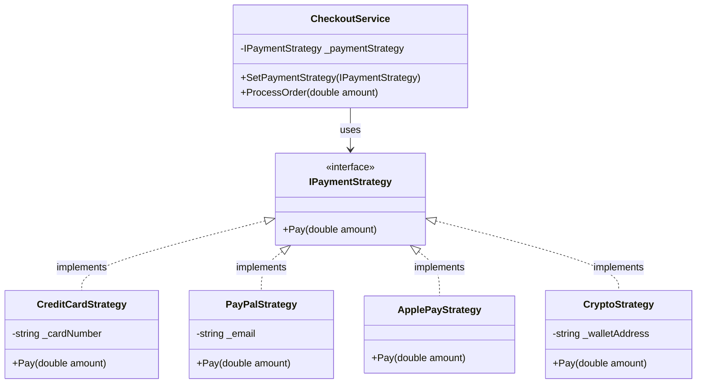

## The Problem I Solved

An e-commerce checkout system needs to support **multiple payment methods** (Credit Card, PayPal, Apple Pay, Crypto). Without Strategy, you'd write:

```csharp
// ❌ BAD — grows into an unmaintainable mess
if (method == "creditcard") { /* ... */ }
else if (method == "paypal") { /* ... */ }
else if (method == "applepay") { /* ... */ }
// Every new payment = another else-if
```

With Strategy, each payment method is its own class. The `CheckoutService` holds a reference to `IPaymentStrategy` and simply calls `Pay()` — it doesn't know or care which method is being used.

## How It Works (Step by Step)

1. **`IPaymentStrategy`** — Interface with a single method: `Pay(double amount)`.
2. **`CreditCardStrategy`, `PayPalStrategy`, etc.** — Each implements `Pay()` differently.
3. **`CheckoutService`** (Context) — Holds an `IPaymentStrategy` reference. Calls `_paymentStrategy.Pay(amount)` when processing an order.
4. **At runtime** — You can swap strategies via `SetPaymentStrategy()` without changing any other code.

## When to Use

- You have **multiple algorithms** for the same task and need to pick one at runtime.
- You want to **eliminate if/else or switch blocks** that select behavior.
- You want to **add new behaviors** without modifying existing code (Open/Closed Principle).
- The algorithm needs to be **swappable** during the object's lifetime.

## Advantages

| ✅ Advantage | Why It Matters |
|---|---|
| Open/Closed Principle | Add new strategies without touching existing code |
| Eliminates conditionals | No more giant if/else chains |
| Runtime flexibility | Swap algorithms on the fly |
| Isolated testing | Each strategy can be unit tested independently |
| Single Responsibility | Each strategy class has one job |

## Disadvantages

| ❌ Disadvantage | Why It Matters |
|---|---|
| Class explosion | Every new algorithm = a new class |
| Client must know strategies | The client picks which strategy to use |
| Overhead for simple cases | If you only have 2 options, a simple if/else may be cleaner |

## Key Files

| File | Role |
|---|---|
| `IPaymentStrategy.cs` | Strategy interface |
| `PaymentStrategies.cs` | 4 concrete strategies |
| `CheckoutService.cs` | Context — delegates to strategy |
| `StrategyDemo.cs` | Proves strategies are swapped at runtime |

---

---

# 📘 Pattern 2: Observer — Order Notifications

## What Is the Observer Pattern?

The Observer pattern defines a **one-to-many dependency** between objects. When the **Subject** (observable) changes state, all its registered **Observers** are notified automatically. Observers can subscribe and unsubscribe at any time.

**Category:** Behavioral Pattern

## Class Diagram

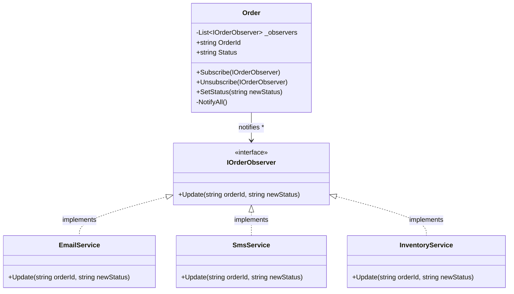

## The Problem I Solved

When an order ships, **multiple disconnected services** need to be notified — Email, SMS, Inventory. Without Observer, the Order class would need to directly call each service:

```csharp
// ❌ BAD — Order is tightly coupled to every service
public void Ship()
{
    emailService.SendEmail(...);
    smsService.SendSms(...);
    inventoryService.UpdateStock(...);
    // Every new service = modify this method
}
```

With Observer, the Order doesn't know what services exist. It just loops through `_observers` and calls `Update()`. Services subscribe/unsubscribe freely.

## How It Works (Step by Step)

1. **`IOrderObserver`** — Interface with `Update(orderId, newStatus)`.
2. **`EmailService`, `SmsService`, `InventoryService`** — Each implements `Update()` to react in its own way.
3. **`Order`** (Subject) — Maintains a `List<IOrderObserver>`. When `SetStatus()` is called, it loops through the list and calls `Update()` on each observer.
4. **Subscribe/Unsubscribe** — Observers can join or leave at any time.

## Notification Flow

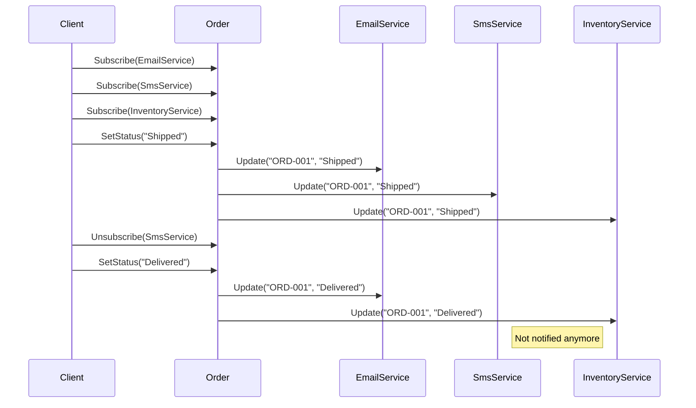

## When to Use

- Changes in one object need to **trigger updates in others** — without tight coupling.
- You don't know **how many** observers will exist at compile time.
- Observers should be able to **subscribe/unsubscribe dynamically**.
- You need an **event system** (Publisher → Subscribers).

## Advantages

| ✅ Advantage | Why It Matters |
|---|---|
| Loose coupling | Subject doesn't know concrete observer types |
| Open/Closed Principle | Add new observers without modifying the Subject |
| Dynamic relationships | Subscribe/unsubscribe at runtime |
| Broadcast communication | One event notifies many listeners |

## Disadvantages

| ❌ Disadvantage | Why It Matters |
|---|---|
| Unexpected updates | Observers may be notified in unpredictable order |
| Memory leaks | Forgetting to unsubscribe can keep objects alive |
| Cascade effects | One notification can trigger a chain of updates |
| Debugging difficulty | Hard to trace which observer caused a bug |

## Key Files

| File | Role |
|---|---|
| `IOrderObserver.cs` | Observer interface |
| `Order.cs` | Subject — maintains observer list, notifies on change |
| `ObserverServices.cs` | 3 concrete observers |
| `ObserverDemo.cs` | Proves subscribe, notify, and unsubscribe work |

---

---

# 📘 Pattern 3: Decorator — Pizza Ordering

## What Is the Decorator Pattern?

The Decorator pattern lets you **attach new behaviors to objects dynamically** by wrapping them in decorator objects. Each decorator adds its own behavior and then delegates to the wrapped object. Decorators are stackable — you can wrap a decorator inside another decorator.

**Category:** Structural Pattern

## Class Diagram

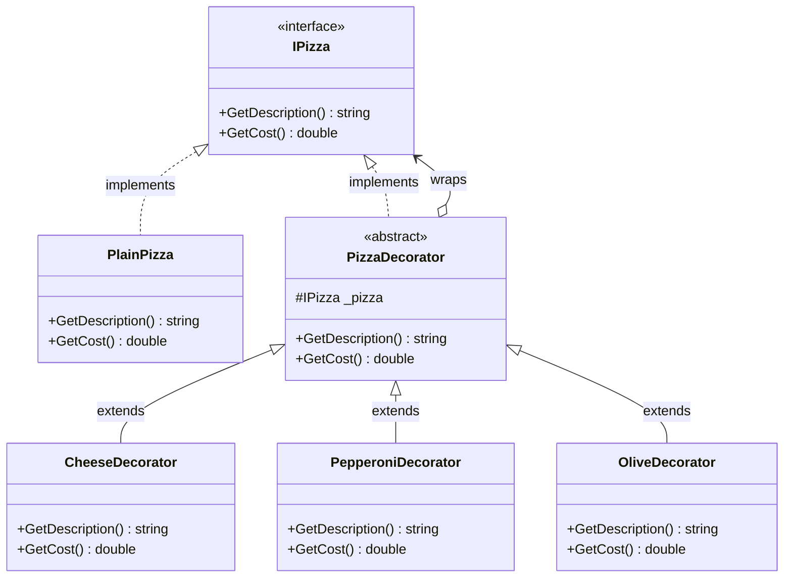

## The Problem I Solved

A pizza ordering system needs **customizable toppings**. Without Decorator, you'd create a subclass for every combination:

```csharp
// ❌ BAD — combinatorial explosion of subclasses
class MargheritaWithCheese : Pizza { }
class MargheritaWithCheeseAndPepperoni : Pizza { }
class MargheritaWithCheeseAndPepperoniAndOlives : Pizza { }
// 3 toppings = 7 possible combinations. 10 toppings = 1023 subclasses!
```

With Decorator, you **wrap** the base pizza with topping layers. Each layer adds its cost and description, then delegates to the inner pizza.

## How Wrapping Works (Visual)

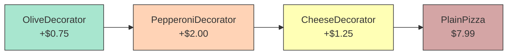

When you call `GetCost()` on the outermost decorator:
- **OliveDecorator** adds $0.75 + asks the next layer →
- **PepperoniDecorator** adds $2.00 + asks the next layer →
- **CheeseDecorator** adds $1.25 + asks the next layer →
- **PlainPizza** returns $7.99

**Total: $7.99 + $1.25 + $2.00 + $0.75 = $11.99**

## How It Works (Step by Step)

1. **`IPizza`** — Component interface with `GetDescription()` and `GetCost()`.
2. **`PlainPizza`** — Base component. Returns "Plain Margherita Pizza" and $7.99.
3. **`PizzaDecorator`** — Abstract decorator. Holds a reference to an `IPizza` and delegates calls to it by default.
4. **`CheeseDecorator`, `PepperoniDecorator`, `OliveDecorator`** — Override `GetDescription()` and `GetCost()` to add their contribution, then delegate to the wrapped pizza.
5. **Stacking** — `new OliveDecorator(new PepperoniDecorator(new CheeseDecorator(new PlainPizza())))` builds up layers dynamically.

## When to Use

- You need to **add responsibilities to objects dynamically** without subclassing.
- You want to **combine behaviors** in different permutations.
- Subclassing would cause a **combinatorial explosion** of classes.
- You want behaviors to be **stackable** (e.g., double cheese).

## Advantages

| ✅ Advantage | Why It Matters |
|---|---|
| No subclass explosion | Combine behaviors freely without N² classes |
| Open/Closed Principle | Add new decorators without modifying existing ones |
| Stackable | Apply the same decorator multiple times (double cheese!) |
| Runtime flexibility | Build objects with exactly the features needed |
| Single Responsibility | Each decorator handles one concern |

## Disadvantages

| ❌ Disadvantage | Why It Matters |
|---|---|
| Many small objects | Lots of wrapper objects in memory |
| Complex construction | Deeply nested constructors can be hard to read |
| Hard to remove layers | Once wrapped, you can't easily unwrap a specific decorator |
| Order may matter | Wrapping order can affect behavior in some cases |

## Key Files

| File | Role |
|---|---|
| `IPizza.cs` | Component interface |
| `PlainPizza.cs` | Concrete component (base pizza) |
| `PizzaDecorator.cs` | Abstract decorator (delegates by default) |
| `ToppingDecorators.cs` | 3 concrete decorators |
| `DecoratorDemo.cs` | Proves stacking and dynamic cost calculation |

---

---

# 📘 Pattern 4: Factory Method — Logistics

## What Is the Factory Method Pattern?

The Factory Method pattern defines an interface for creating objects, but lets **subclasses decide which class to instantiate**. The base class provides a method (the "factory method") that subclasses override to return different types of objects.

**Category:** Creational Pattern

## Class Diagram

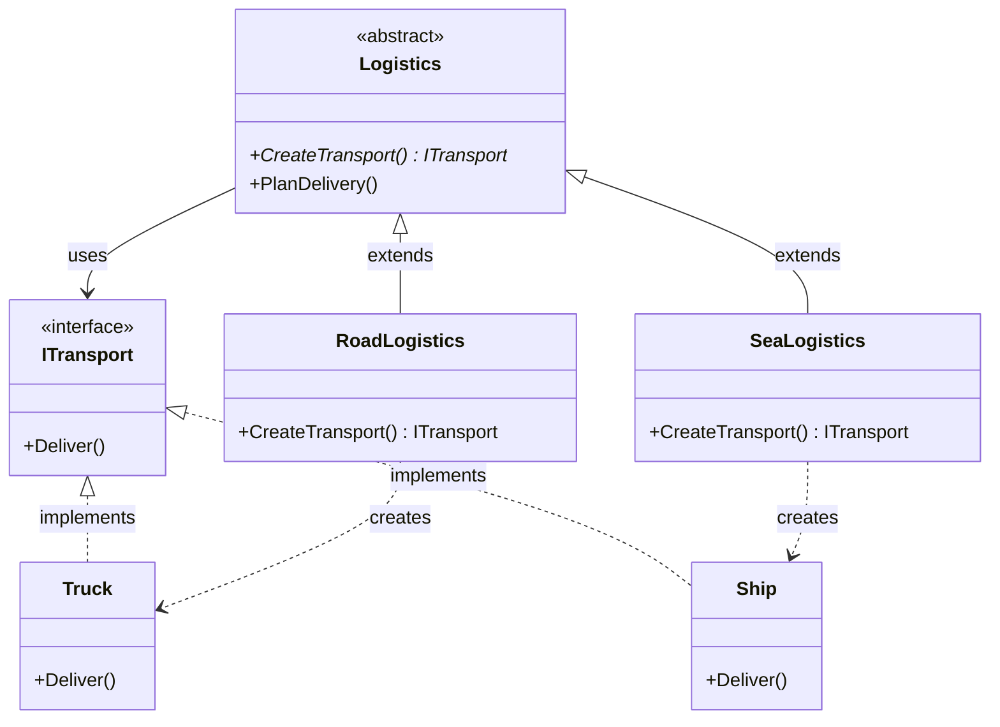

## The Problem I Solved

A logistics application needs to spawn different **delivery vehicles** based on transport type. Without Factory Method, the logistics code would be littered with conditionals:

```csharp
// ❌ BAD — the base class knows about all transport types
public ITransport CreateTransport(string type)
{
    if (type == "road") return new Truck();
    else if (type == "sea") return new Ship();
    // Every new transport = modify this method
}
```

With Factory Method, each logistics subclass overrides `CreateTransport()` to return its own transport type. The base class calls the factory method without knowing which product it gets.

## How It Works (Step by Step)

1. **`ITransport`** — Product interface with `Deliver()`.
2. **`Truck`, `Ship`** — Concrete products implementing `Deliver()`.
3. **`Logistics`** (Creator) — Abstract class with:
   - `CreateTransport()` — abstract factory method (subclasses decide what to return).
   - `PlanDelivery()` — calls `CreateTransport()`, then uses the result.
4. **`RoadLogistics`** — Overrides `CreateTransport()` to return a `Truck`.
5. **`SeaLogistics`** — Overrides `CreateTransport()` to return a `Ship`.

## Factory Method Flow

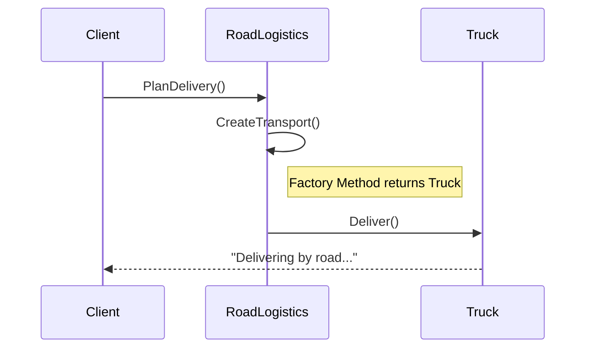

## When to Use

- You **don't know ahead of time** which class to instantiate.
- You want subclasses to **control the creation** of objects.
- You want to **decouple** object creation from usage.
- You follow the principle: *"Program to an interface, not an implementation."*

## Advantages

| ✅ Advantage | Why It Matters |
|---|---|
| Loose coupling | Creator doesn't know concrete product types |
| Open/Closed Principle | Add new products by adding new creator subclasses |
| Single Responsibility | Creation logic is in one place per subclass |
| Polymorphism | Client code works with the base `Logistics` type |

## Disadvantages

| ❌ Disadvantage | Why It Matters |
|---|---|
| Class hierarchy | Requires a creator subclass for each product |
| Complexity | Can be overkill for simple creation needs |
| One product per factory | Each factory method creates one type of product |

## Key Files

| File | Role |
|---|---|
| `ITransport.cs` | Product interface + concrete products (Truck, Ship) |
| `Logistics.cs` | Abstract creator + concrete creators (Road, Sea) |
| `FactoryMethodDemo.cs` | Proves polymorphic dispatch and factory method |

---

---

# 📘 Pattern 5: Adapter — Legacy Score Saver

## What Is the Adapter Pattern?

The Adapter pattern allows **incompatible interfaces to work together**. It wraps an existing class (the **Adaptee**) with a new class (the **Adapter**) that implements the interface the client expects (the **Target**). The adapter translates calls from the Target interface into calls the Adaptee understands.

**Category:** Structural Pattern

## Class Diagram

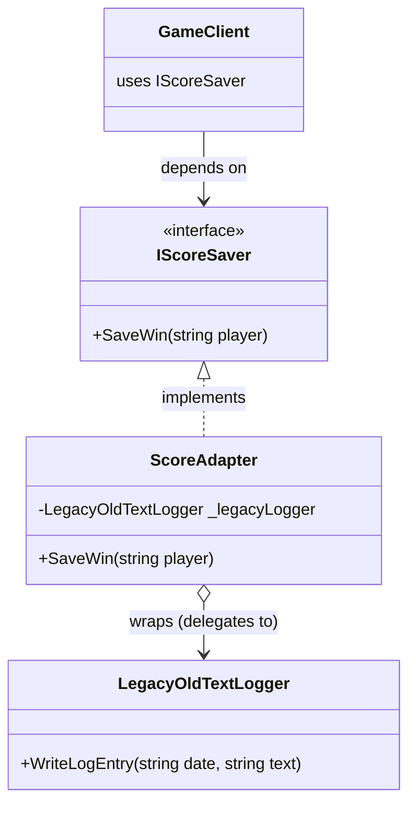

## The Problem I Solved

A modern game expects an **`IScoreSaver`** interface with `SaveWin(string player)`. But we're forced to use a third-party **`LegacyOldTextLogger`** that only has `WriteLogEntry(string date, string text)`. We **cannot modify** the legacy class.

```
Modern game expects:    SaveWin("Alice")           → one parameter
Legacy logger has:      WriteLogEntry(date, text)  → two parameters, different format

❌ These don't match!
```

The `ScoreAdapter` implements `IScoreSaver` and internally translates the call:

```
SaveWin("Alice")  →  WriteLogEntry("2026-06-02 23:00:00", "WINNER recorded — Player: Alice")
```

## Translation Flow

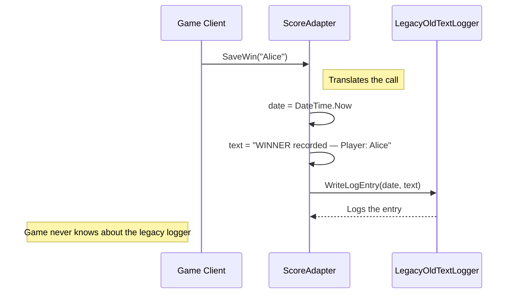

## How It Works (Step by Step)

1. **`IScoreSaver`** (Target) — The interface the modern game expects: `SaveWin(string player)`.
2. **`LegacyOldTextLogger`** (Adaptee) — The incompatible third-party class with `WriteLogEntry(string date, string text)`. We **cannot change it**.
3. **`ScoreAdapter`** (Adapter) — Implements `IScoreSaver`. Holds a reference to `LegacyOldTextLogger`. Inside `SaveWin()`, it:
   - Generates the current date string.
   - Formats a log message from the player name.
   - Calls `_legacyLogger.WriteLogEntry(date, message)`.
4. **The game client** — Only depends on `IScoreSaver`. It has zero knowledge of the legacy logger.

## The Three Participants

| Participant | Class | Role |
|---|---|---|
| **Target** | `IScoreSaver` | The interface the client expects |
| **Adaptee** | `LegacyOldTextLogger` | The incompatible class we cannot modify |
| **Adapter** | `ScoreAdapter` | Bridges Target ↔ Adaptee by translating calls |

## When to Use

- You need to use an **existing class** but its interface doesn't match what you need.
- You're integrating with **third-party or legacy code** you can't modify.
- You want to create a **reusable bridge** between incompatible systems.
- You're wrapping an **old API** to conform to a new interface standard.

## Advantages

| ✅ Advantage | Why It Matters |
|---|---|
| Single Responsibility | Translation logic is isolated in one class |
| Open/Closed Principle | Adapters don't modify existing classes |
| Reusability | Legacy code works in modern systems without changes |
| Decoupling | Client depends only on the Target interface |

## Disadvantages

| ❌ Disadvantage | Why It Matters |
|---|---|
| Added complexity | Extra indirection layer between client and adaptee |
| Not always transparent | Complex translations can hide important behavior |
| One adapter per adaptee | Each incompatible class needs its own adapter |

## Object Adapter vs. Class Adapter

This implementation uses the **Object Adapter** variant (composition):

| Variant | Mechanism | Pros | Cons |
|---|---|---|---|
| **Object Adapter** ✅ (used here) | Composition — adapter *holds* the adaptee | Works with adaptee subclasses, more flexible | Extra object in memory |
| **Class Adapter** | Inheritance — adapter *extends* the adaptee | Direct access to adaptee methods, no extra object | C# doesn't support multiple inheritance, less flexible |

## Key Files

| File | Role |
|---|---|
| `IScoreSaver.cs` | Target interface |
| `LegacyOldTextLogger.cs` | Adaptee — the incompatible legacy class |
| `ScoreAdapter.cs` | Adapter — translates SaveWin → WriteLogEntry |
| `AdapterDemo.cs` | Proves the game uses IScoreSaver, legacy logger does the work |

---

---

# 📘 Pattern 6: Singleton — Game Scoreboard

## What Is the Singleton Pattern?

The Singleton pattern ensures a class has **only one instance** and provides a **global point of access** to it. The constructor is private, and a static method (`GetInstance()`) either creates the instance on first call or returns the existing one.

**Category:** Creational Pattern

## Class Diagram

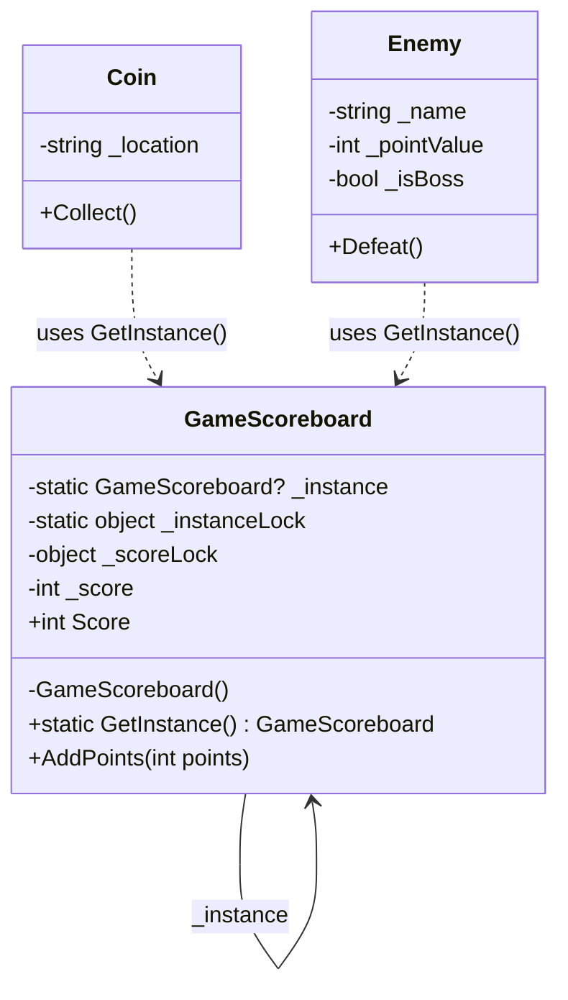

## The Problem I Solved

In a game, multiple different objects (`Coin`, `Enemy`) need to update **one single player score**. Without Singleton, you'd need to pass a score object everywhere:

```csharp
// ❌ BAD — passing the scoreboard to every object is tedious and error-prone
coin.Collect(scoreboard);
enemy.Defeat(scoreboard);
boss.Defeat(scoreboard);
// What if someone creates a second scoreboard? Scores get split!
```

With Singleton, any object anywhere in the code calls `GameScoreboard.GetInstance()` and gets the **exact same instance**. No passing, no risk of duplicates.

## Thread-Safe Double-Checked Locking

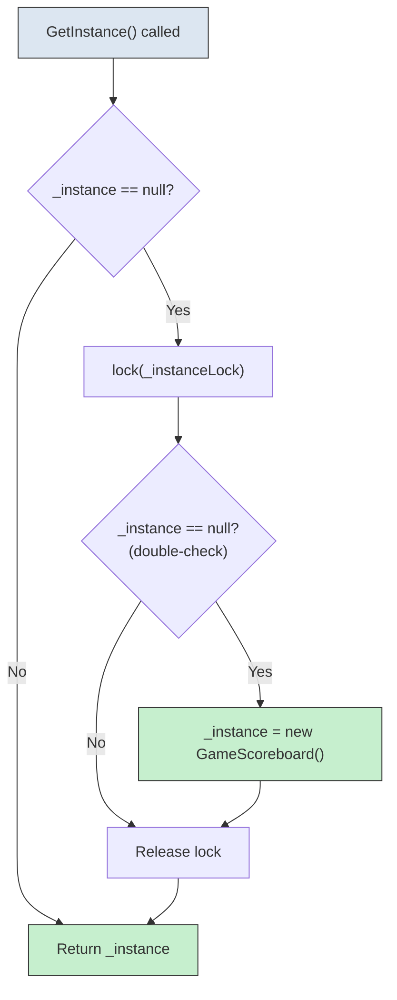

**Why double-check?** Two threads could both pass the first `null` check simultaneously. The `lock` ensures only one creates the instance. The second check inside the lock prevents the second thread from creating a duplicate.

## How It Works (Step by Step)

1. **Private constructor** — `private GameScoreboard()` prevents anyone from calling `new GameScoreboard()`.
2. **Static `_instance` field** — Holds the single instance (starts as `null`).
3. **`GetInstance()`** — Uses double-checked locking:
   - First check: if `_instance` is not null, return it immediately (fast path).
   - If null: lock, check again, then create.
4. **`AddPoints(int)`** — Thread-safe method to add to the score.
5. **`Coin.Collect()` / `Enemy.Defeat()`** — Call `GameScoreboard.GetInstance().AddPoints(...)`. They never hold a reference — they fetch the singleton every time.

## Proof of Singleton

The demo proves it with this code:

```csharp
var board1 = GameScoreboard.GetInstance();
var board2 = GameScoreboard.GetInstance();
Console.WriteLine(board1 == board2);           // True
Console.WriteLine(board1.GetHashCode() == board2.GetHashCode()); // True — same object in memory
```

## When to Use

- You need **exactly one instance** of a class (database connection, logger, config, scoreboard).
- You need **global access** to that instance without passing it everywhere.
- The instance must be **created lazily** (only when first needed).
- **Thread safety** is required in multi-threaded applications.

## Advantages

| ✅ Advantage | Why It Matters |
|---|---|
| Controlled access | Only one instance, guaranteed |
| Global access point | Any code can reach it via `GetInstance()` |
| Lazy initialization | Created only when first needed |
| Thread safety | Double-checked locking prevents race conditions |

## Disadvantages

| ❌ Disadvantage | Why It Matters |
|---|---|
| Global state | Acts like a global variable — can hide dependencies |
| Hard to test | Difficult to mock or replace in unit tests |
| Tight coupling | Code depends on the concrete Singleton class |
| Violates SRP | The class manages its own lifecycle AND its business logic |
| Concurrency complexity | Thread-safe implementation adds complexity |

## Key Files

| File | Role |
|---|---|
| `GameScoreboard.cs` | Singleton class + Coin and Enemy game objects |
| `SingletonDemo.cs` | Proves same instance, shared score across objects |

---

---

# 📊 Quick Reference — All Patterns Compared

| # | Pattern | Category | Problem Solved | Key Principle |
|---|---|---|---|---|
| 1 | **Strategy** | Behavioral | Multiple algorithms, swap at runtime | *Encapsulate what varies* |
| 2 | **Observer** | Behavioral | Notify many objects of state changes | *Loose coupling between publisher and subscribers* |
| 3 | **Decorator** | Structural | Add behavior dynamically without subclassing | *Composition over inheritance* |
| 4 | **Factory Method** | Creational | Let subclasses decide which object to create | *Program to an interface, not an implementation* |
| 5 | **Adapter** | Structural | Make incompatible interfaces work together | *Wrap the old, expose the new* |
| 6 | **Singleton** | Creational | Ensure only one instance exists globally | *Controlled access to a shared resource* |

---

# 🧠 How to Remember Each Pattern

| Pattern | Memory Hook |
|---|---|
| **Strategy** | *"The algorithm is a plug-in — swap it anytime."* |
| **Observer** | *"When I change, I broadcast to everyone listening."* |
| **Decorator** | *"Russian nesting dolls — each layer adds something."* |
| **Factory Method** | *"I don't create the product — my subclass does."* |
| **Adapter** | *"A travel power adapter — same plug, different socket."* |
| **Singleton** | *"There can be only one."* |

---

# 📚 References

- **Gang of Four Book:** *Design Patterns: Elements of Reusable Object-Oriented Software* — Gamma, Helm, Johnson, Vlissides (1994)
- **Refactoring.Guru:** [https://refactoring.guru/design-patterns](https://refactoring.guru/design-patterns) — Visual explanations of all GoF patterns
- **Head First Design Patterns:** *A Brain-Friendly Guide* — Freeman & Robson

---

> **Built for studying GoF design patterns through real C# implementations. Each folder is an independent, self-contained example.**
